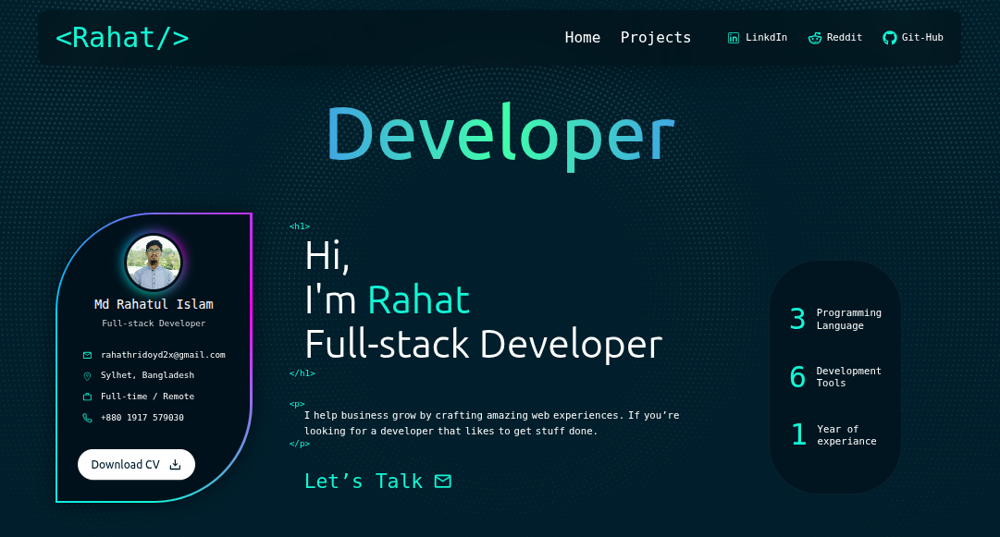

# 🚀 Full Stack Portfolio Website

[ Live Link : https://rahat-hridoy.vercel.app/]

---

## 📌 Project Overview

This project is a fully custom-designed and developed **Full Stack Portfolio Website** created to showcase my projects, experience, and technical skills in a professional, real-world manner.

Instead of a static portfolio, this application is built as a **dynamic, database-driven system** where all portfolio content can be managed through a secure admin dashboard without modifying the source code.

---

## 🎯 Project Objectives

- Build a professional personal portfolio from scratch
- Apply advanced React concepts in a real-world project
- Replace static UI content with a dynamic system
- Implement a secure admin dashboard for content management
- Protect sensitive routes using authentication

---

## 🛠️ Tech Stack

### Frontend

- React.js
- Tailwind CSS
- Advanced component architecture
- Animation : Framer Motion
- Fully responsive design

### Backend & Database

- Supabase
  - Database management

### Additional Tools

- EmailJS (contact system)
- Git & GitHub
- Vercel

---

## ✨ Key Features

### 🔹 Dynamic Project Showcase

- Projects are fetched dynamically from the database
- Project cards update automatically based on data changes
- Visitors can easily review projects and experience

---

### 🔹 Admin Dashboard (Core Feature)

The most important feature of this portfolio is the **Admin Dashboard**.

Using the dashboard, I can:

- Create new projects
- Update existing projects
- Delete projects
- Manage all portfolio content without touching the code

All operations are handled dynamically through the Supabase database.

---

### 🔹 Authentication & Security

- Secure login system implemented
- Dashboard routes are protected
- Unauthorized users cannot access admin features

---

### 🔹 Contact System

- Contact feature implemented using EmailJS
- Visitors can directly connect through the portfolio
- No custom backend server required

---

### 🔹 Animations & User Experience

- Smooth animations integrated across the UI
- Improved user engagement and interaction
- Clean and modern interface design

---

## 🧠 Key Learnings

Through this project, I gained hands-on experience with:

- Advanced React concepts and component planning
- Animation integration in production-ready applications
- Dashboard-based CRUD operations
- Supabase database and authentication
- Scalable full-stack application architecture

---

## 📈 Project Significance

This project demonstrates my ability to:

- Design and develop complete full-stack applications
- Build scalable and maintainable systems
- Apply modern frontend and backend technologies
- Solve real-world problems beyond static UI development

---

## 🔮 Future Enhancements

- Blog page integration
- Blog management system
- SEO optimization

---

## 📬 Contact

Visitors can contact me directly through the portfolio’s contact section. or

Phone : **+880-1917-579030**

Email : **rahathridoyd2x@gmail.com**
